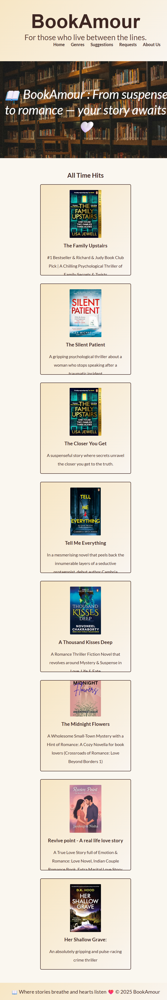
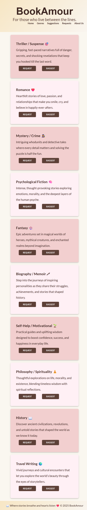

# 📚 BookAmour - The Ultimate Digital Bookshelf

## ✨ Introduction

**BookAmour** is a full-stack web application designed for book lovers. It serves as a digital haven where users can explore, search, and manage books. From browsing various genres to registering an account to vote on their favorite titles, the site offers a beautiful and intuitive experience.

> *"BookAmour is not just a website; it is a meticulously crafted digital library, with a clean and elegant design that makes finding your next great read an absolute pleasure."*

---

## 🔗 Live Site and Repository

| Resource | Link |
| :--- | :--- |
| **Live Site (Render)** | **https://bookamour.onrender.com/about** |
| **GitHub Repository** | [https://github.com/Harikareddi13/BookAmour.git](https://github.com/Harikareddi13/BookAmour.git) |

---

## 🛠 Technologies Used

| Category | Technologies |
| :--- | :--- |
| **Frontend** | **HTML**, **CSS**, **EJS** (Templating Engine) |
| **Backend** | **Node.js** |
| **Database** | **MySQL** (Hosted on **Clever Cloud** 🌐) |
| **Frameworks/Libraries** | **Express.js**, **Express-session** (user sessions) 🔒, **Multer** (file uploads) 📷, **Faker.js** (unique ID generation) |
| **DevOps** | **Git** & **GitHub** (Version Control), **Render** 🚀 (Hosting & Deployment) |
| **Database Hosting** | **Clever Cloud** 🌩️ |

---

## 📸 Stunning Visuals

To showcase the application's clean design and features, the main views are displayed below.

<table width="100%">
  <tr>
    <td align="center">
      <h3>Home Page</h3>
      
      
The inviting landing page, serving as the gateway to the digital library.

    </td>
    <td align="center">
      <h3>Genre Page</h3>
      
      
A focused view of curated book lists, allowing users to discover and engage.

    </td>
  </tr>
  <tr>
    <td colspan="2" align="center">
      <h3>About Page</h3>
      
      
Information about the project and its goals, presented with clarity.

    </td>
  </tr>
</table>

---

## 🎓 What I Learned

Developing BookAmour provided critical, real-world experience in several key areas of full-stack engineering:

* **Full-Stack Setup:** Successfully setting up a complete **Node.js** project using **Express.js** and rendering dynamic content with **EJS**.
* **Remote Database Integration:** Mastering the essential skill of connecting a **Node.js** app to a remotely hosted **MySQL** database using **Clever Cloud** 🌩️.
* **Security & Data Handling:** Implementing user authentication using **Express-session** 🔒 and ensuring secure configuration by properly managing **environment variables** 💡 for deployment secrets.
* **Advanced Features:** Handling complex features like **file uploads** (for book covers or user images) using the **Multer** library.
* **Deployment Workflow:** Successfully deploying the entire full-stack project using **Render** 🚀, ensuring seamless communication between the application and the external database service.

---

## 🌟 Conclusion

BookAmour stands as a successful example of utilizing modern cloud infrastructure—**Clever Cloud** for the database and **Render** for deployment—to build a responsive and beautiful web application. This project not only serves as a functional service for book lovers but also represents a comprehensive learning journey across the full development stack.
